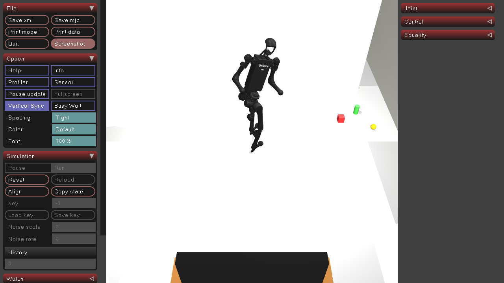

# Text2Wheel

Text2Wheel is an innovative project that bridges natural language understanding with robotic navigation. It enables users to control a robot car using simple voice commands like "Go to the kitchen," which are automatically translated into precise wheel speeds for real-time navigation with obstacle avoidance. Built on PyBullet simulation, this project demonstrates the powerful combination of Large Language Models (LLMs) and robotics for zero-shot navigation capabilities.

## Project Overview

| Field        | Content                                                    |
| ------------ | ---------------------------------------------------------- |
| Name         | **Text2Wheel**                                             |
| Summary      | Automatically translates "Go to the kitchen" into car speeds for real-time obstacle avoidance navigation in **Mujoco**. |
| Keywords     | LLM × Robotics × Natural Language × Zero-Shot Navigation   |
| Simulator    | PyBullet (GUI visualization, fully supported on macOS/Windows/Linux) |
| Hardware     | Any laptop capable of running Python (including M1)       |

## Features

- **Natural Language Control**: Issue commands in plain English like "Go to the kitchen" or "Move to the living room"
- **Real-time Navigation**: Instant translation of commands into wheel speeds and movement
- **Obstacle Avoidance**: Smart navigation around obstacles in the environment
- **Zero-shot Learning**: No training required for new navigation commands
- **Cross-platform**: Works on macOS, Windows, and Linux
- **Low Hardware Requirements**: Runs on any Python-capable laptop, including M1 Macs

## Getting Started

This repository provides everything you need to run the Text2Wheel system in PyBullet simulation. Follow the setup instructions to start navigating with natural language commands.

using conda environment:

`conda activate pybullet_env`

install necessary requirements

`pip install -r requirements.txt`

run using mjpython

`mjpython main.py`

## How It Works

1. **Voice/Text Input**: User provides natural language commands
2. **LLM Processing**: Large Language Model interprets the command
3. **Motion Planning**: System translates command into wheel speeds
4. **Real-time Execution**: Robot car navigates while avoiding obstacles
5. **Visual Feedback**: PyBullet provides real-time 3D visualization
